# Project : Node & React Development
## Chapter 1 : The setup

For our project, using a PostgreSQL database is mandatory.

To setup the database you need to follow these instruction :

When you create the database, enter the name `projet_node` and after, click on *Connection*.

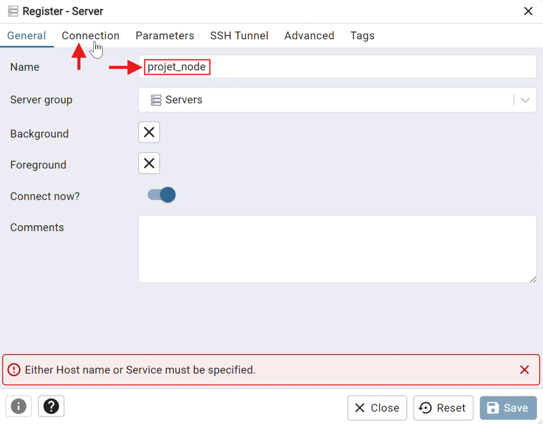

You need to write the Host name/adress `localhost`, write your password (and enable `Save Password?` if you want) and then click on `Save`.

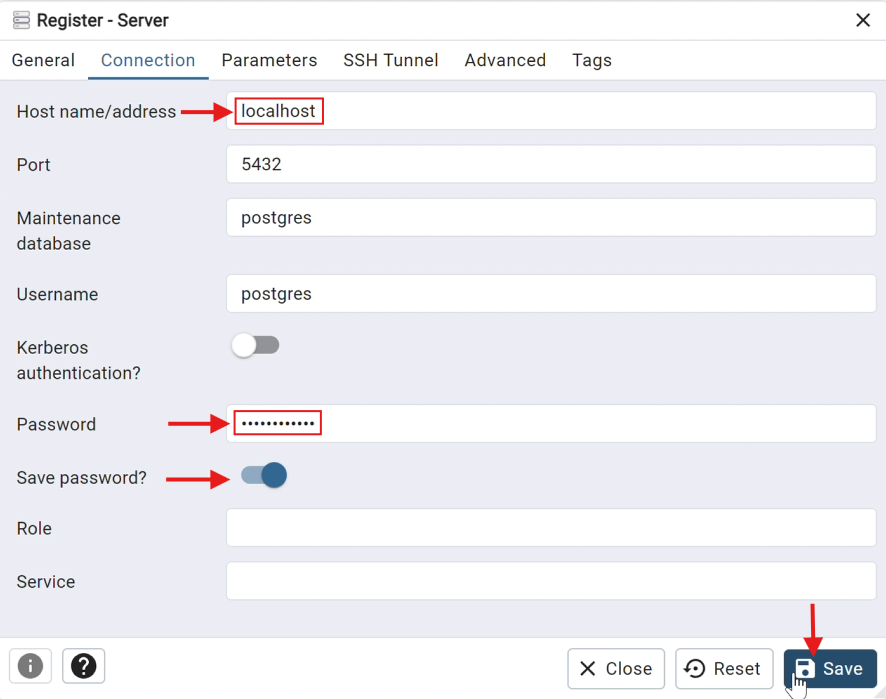

After clicking on `Save` you should see the icon with `projet_node` appear, left click on `projet_node`. Select *Create* and `Login/Group Role...`.

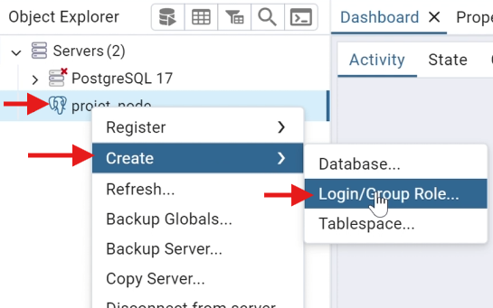

Now, enter the name `projet_node_user` and then click on `Definition`

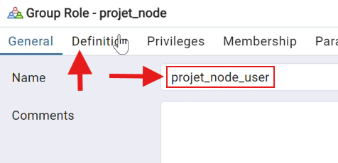

Enter the Password `1234` (this password and not another), and then click on `Privileges`.

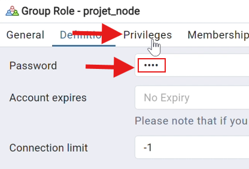

Here you need to enable every privileges, and after click on `Save`.

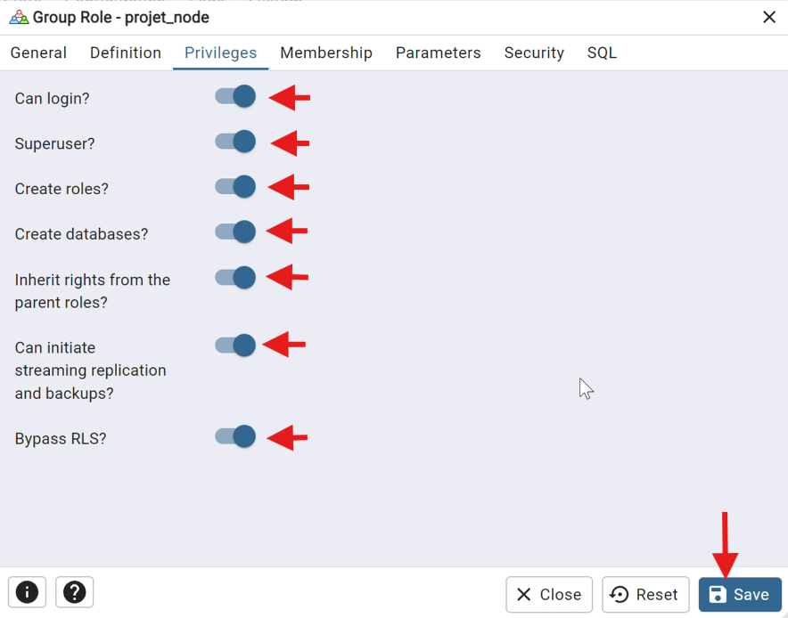

Right click on the icon named `projet_node`. Click on `Create` and `Database...`.

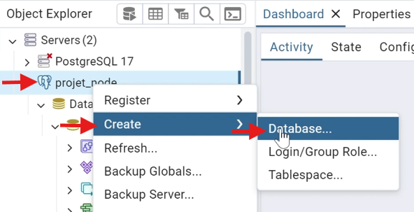

Write for the Database's name `projet_node_db`, select `projet_node_user` for the Owner of the database. Click on `Save`.

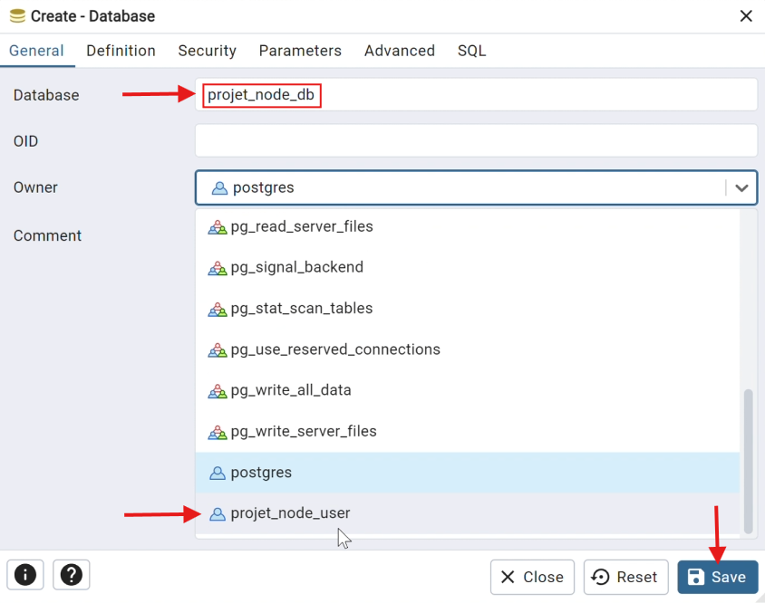

Now you need to open the file [Backend](https://github.com/Briconawak/ProjectNode/tree/main/Backend) on IntelliJ IDEA.

Run the file [app.ts](https://github.com/Briconawak/ProjectNode/blob/main/Backend/Backend/src/app.ts).

Normally, you should have the same message in the terminal.

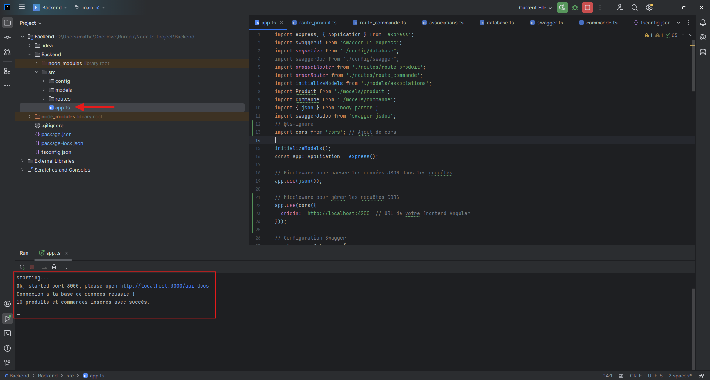

(Think to make a `npm install` if you didn't made it)

Now the last step is, using the cmd, going in the file [Frontend](https://github.com/Briconawak/ProjectNode/tree/main/Frontend) and start the website unsing the command `ng serve`.

Finally, go to [this link](http://localhost:4200) to end on the website.

## Chapter 2 : Presentation of the website

We created a website for online sales.

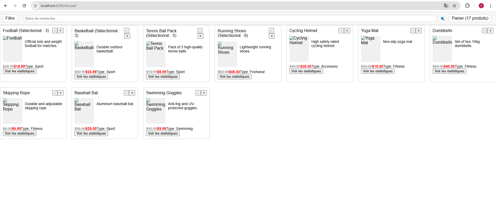

When you click on *Ajouter au panier*, the item is added in the basket. You can also add or remove items from the basket, and it's showing the total price.

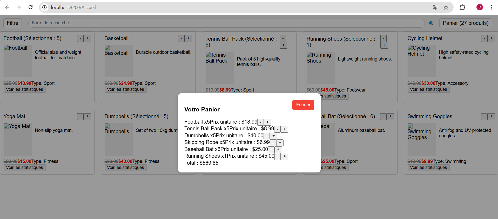

You can also research a product by his name.

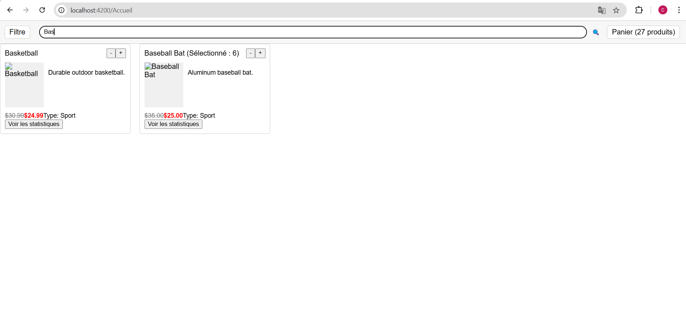

We implemented a filter to allow you to filter by Category, by asc/desc price or by promo.

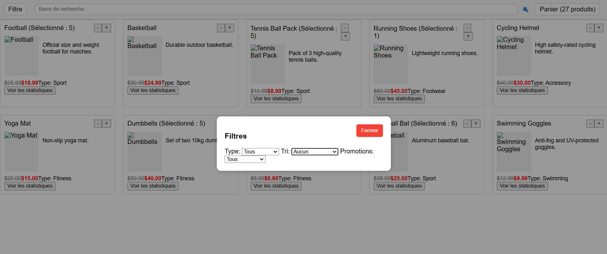

  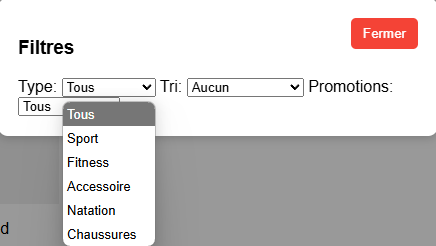
  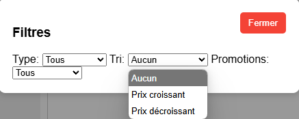
  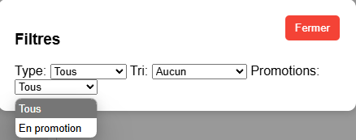

